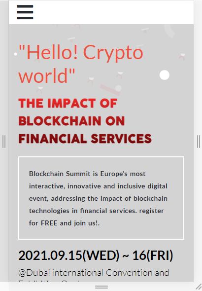
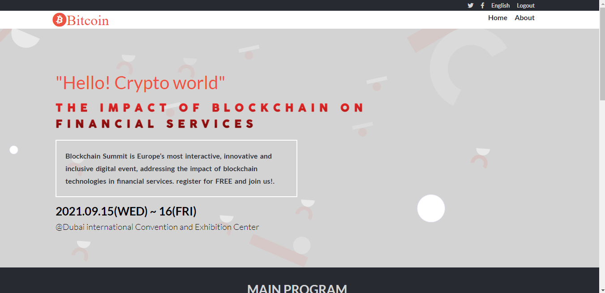

# Capstone-conference-project

>  This is a capstone project for a block chain summit in Dubai! that follows the design guidelines found [here](https://www.behance.net/gallery/29845175/CC-Global-Summit-2015)
 Both mobile and desktop version was designed for this project

Mobile Version Screenshot

Desktop Version Screenshot

# Built With
- HTML
- CSS
- JAVASCRIPT

# Live Demo
Visit this [link](https://dami1080.github.io/Capstone-conference-project/) for the demo

# Loom Video
Watch this [video](https://www.loom.com/share/32f465a47f4548b39682738575167e1e)

# Getting started

## To get a local copy of this repository kindly follow the steps below.
- Scroll to top of this current repository
- Click on the `Code` button with background color green on the right end corner
- Click on the clipboard icon on the extreme right of the dropdown to copy the repository link
- In your local PC, open your terminal or command prompt in the folder you would like to clone this repository into
- Type `git clone (copied link)` on the currently opened terminal or command prompt

# Authors

Akintoye Damilare

- Github: [Github](https://github.com/dami1080/Capstone-conference-project)

# Contributing
Contributions, issues, and feature requests are welcome!

Feel free to check the [issues page.](https://github.com/dami1080/Capstone-conference-project)

# Show your support
Give a :star: if you like this project!

# Acknowledgements

- A special thanks to [Cindy Shin](https://www.behance.net/adagio07) whose design template was used
- Microverse

